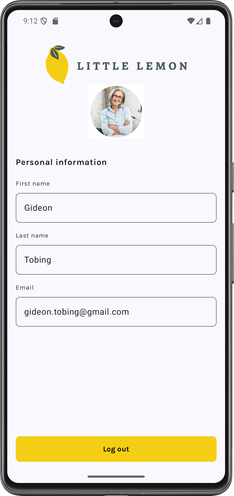

# Little Lemon App


## About The Project

Little Lemon is a modern Android restaurant application developed as the capstone project for Meta's Android Developer Professional Certificate program on Coursera. This app provides a seamless food ordering experience, allowing users to browse the Little Lemon restaurant's menu and place orders with an intuitive and user-friendly interface.

### Key Features

- **Onboarding Flow**: User registration and profile setup
- **Menu Browsing**: Browse through Little Lemon's delicious menu items
- **Order Management**: Add items to cart and place orders
- **User Profile**: Manage personal information and preferences
- **Modern UI**: Clean, responsive design following Material Design principles
- **Smooth Navigation**: Intuitive user experience with seamless transitions

## 🛠Built With

- **Kotlin** - Primary programming language
- **Android SDK** - Android development framework
- **Jetpack Compose** - Modern UI toolkit
- **Material Design** - UI/UX design principles
- **Room Database** - Local data persistence 
- **Ktor** - Network operations

## Installation

**Clone the repository**
   ```bash
   git clone https://github.com/gideonseven/little_lemon_capstone.git
   ```
   
## App Flow

### 1. Onboarding Screen
- Welcome users to Little Lemon
- Collect user personal details (name, email, etc.)
- User registration and profile creation

### 2. Home Screen
- Display restaurant information
- Featured menu items
- Navigation to different sections

### 3. Menu Screen
- Browse complete menu catalog
- Filter and search functionality
- Item details and pricing

### 4. Profile Screen
- View user information

## Screenshots

| Onboarding | Home Screen | Profile                          |
|------------|-------------|----------------------------------|
|  |  |  |

## License

This project is created for educational purposes as part of the Meta Android Developer Professional Certificate program on Coursera.

## Contact

**Gideon Tobing**
- GitHub: [@gideonseven](https://github.com/gideonseven)
- Project Link: [https://github.com/gideonseven/little_lemon_capstone](https://github.com/gideonseven/little_lemon_capstone)

## Acknowledgments

- Meta Android Developer Professional Certificate Program
- Coursera for providing the learning platform
- Android development community for resources and support

---

**If you found this project helpful, please give it a star!**